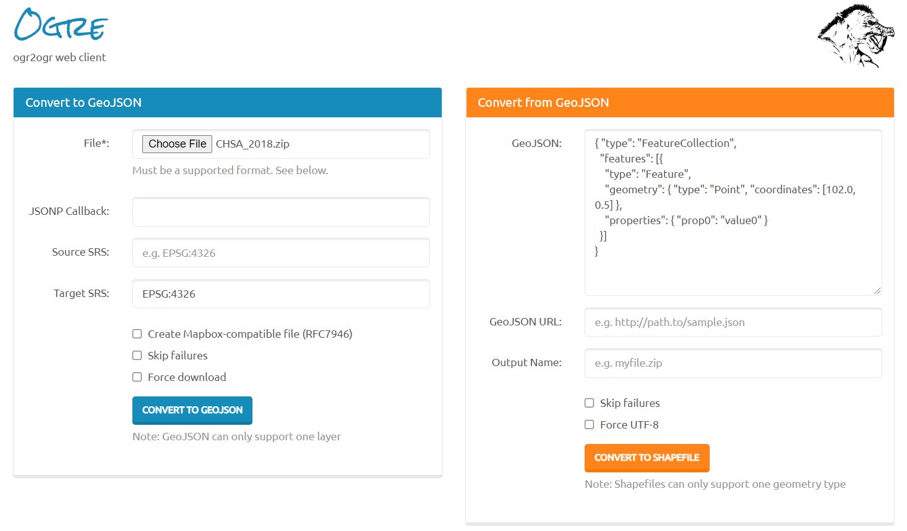

# Clinic Map v1 (DRAFT)

This project is still in development. Version 1 will soon be split to 2 versions.

The app is hosted on GitHub Pages here: ...

**Note**: If you're on mobile, rotate your device for best experience. 

## TODO

- Legend
  - Use scale functions
- Styling
  - Decide on a scale functions
  - In the styling functions, use scale functions where appropriate
- Bundler
- JSDOCs
- Fix loading screen to appear at the appropriate time
- Get an ISU image for loading screen

## Description

This version has two layers to toggle through. One layer is just the point markers of where all the addresses are, and the second layer is those same point markers scaled to size of the number of physicians working at the clinic. The point markers are also color coded based on identifers. 

## Documentation

...JS DOCS

## Getting Started

### Features

- Map Container 
  - A view over some geography
  - View vector data (points)
    - Two point marker layers (both with custom icons)
      - One styled based on size (proportional)
      - Both styled based on identifiers
  - Two base maps 
  - OpenLayer Controls
    - Layer switcher to hide / show layers and base maps
    - Zoom in / out
    - Map scale
    - Full screen mode
    - Popup to show information of the clicked point marker
    - Legend 
      - Can handle proportional symbol mapping of point markers
      - Can handle color coding of point markers (e.g., choropleth)

### Users

A walk-through of the web app

The program is built so that users never have to touch code. Just open the JSON and enter what you want.

Cant be colored and choropleth. It's one or the other.

"id" is how we'll get the layer from using this.map.layers
"shapetype" well help with styling
"url" leads to the geojson file
"title" is how itll appear in the layer switcher, , should be the same as the object key
"theme" is the style preference when the "styletype" is custom
"style" is for coloring the features of a layer
"visible" to set the layer visibility 
"popup" is for formatting the popup

### Developers

#### Project Development

1. Clone the repo to your desired file directory
2. Download [Web Server for Chrome](https://chrome.google.com/webstore/detail/web-server-for-chrome/ofhbbkphhbklhfoeikjpcbhemlocgigb) or [Live Server in VSCode](https://marketplace.visualstudio.com/items?itemName=ritwickdey.LiveServer)
3. Open the web app in your preferred text editor if using Web Server for Chrome, otherwise use VSCode
4. Use [Chrome DevTools](https://developers.google.com/web/tools/chrome-devtools/) for debugging
   - Ensure that cache is disabled in DevTools
5. Ensure the languages you work with are included in the system PATH

#### File Conversions

###### Use ORGE to Convert SHP to / from GeoJSON

[](https://ogre.adc4gis.com/)

###### Use Python Script to Convert from Excel to GeoJSON

**Note**: The installation instructions are for Windows devices, but may work on Mac.

1. Install [*Anaconda Navigator*](https://www.anaconda.com/)
2. Get GeoPandas
   - Open *Anaconda Prompt* as admin and create a new environment called ```geo_env```.
     - See full commands for this step at [*GeoPandas Getting Started*](https://geopandas.readthedocs.io/en/latest/getting_started/install.html#creating-a-new-environment)
3. Next, open *Anaconda Navigator* and click on ```Home``` and set ```Applications on``` to ```geo_env``` instead of ```base (root)```. 
   - Click the ```install``` button for *Spyder* in the *Anaconda Navigator*. 
4. After all these steps you should be ready to run the new environment in Spyder for Python scripting.
     - Additionally, run the following command in the Spyder terminal:  ```pip install openpyxl```

## Authors

[Innovation Support Unit - Department of Family Practice at UBC](https://isu.familymed.ubc.ca/)

[Omar Kawach](https://omarkawach.github.io/)

## Credit and Acknowledgements

[Bruno St-Aubin at Statistics Canada - Components and Workflow](https://github.com/SGC-CGS/geo-explorer)

[OpenLayers - Source Code](https://github.com/openlayers/openlayers)

[Jean-Marc Viglino - OpenLayers Extension](https://github.com/Viglino/ol-ext)

[Matt Walker - OpenLayers LayerSwitcher](https://github.com/walkermatt/ol-layerswitcher)

[White Google Maps Pin](http://www.clker.com/clipart-white-google-map-pin-1.html)

## Resources

#### GIS

[Spatial references](https://spatialreference.org/ref/epsg/)

#### OpenLayers

**Note:** Coordinate format is Longitude / Latitude. 
